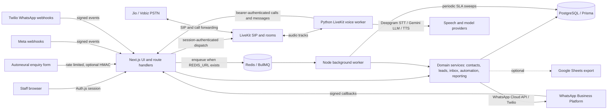
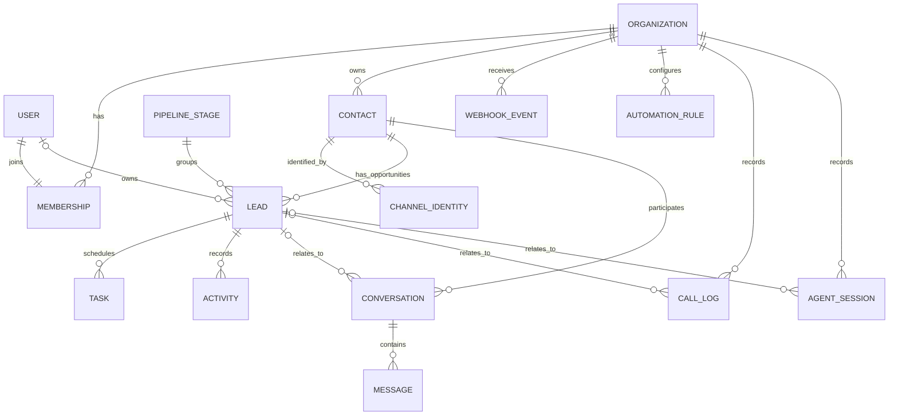

# AutoNeural CRM — General System Design and LLD

**Status:** Current implementation plus clearly marked production improvements  
**Date:** 2026-09-23  
**Scope:** CRM workspace, customer acquisition, conversations, workflow automation, AI calling, integrations, reporting and operations. Property listings are outside the active product scope.

## 1. Purpose and design goals

AutoNeural CRM is a tenant-scoped workspace for capturing business enquiries, maintaining customer and channel identity, progressing sales opportunities, handling conversations, assigning follow-ups and recording AI-assisted calls.

The design aims to keep customer records consistent across channels, enforce organization boundaries in every service operation, make provider events safe to retry, retain an auditable history and let the team continue working when optional providers are disconnected. The existing codebase is a Next.js modular monolith backed by PostgreSQL/Prisma, with a separate Python LiveKit voice worker. Redis is optional for webhook queues; the application has an inline processing fallback.

## 2. Scope and requirements

**Functional:** authenticated staff and role controls; public enquiry and lead import; contacts and leads; configurable sales stages and services; WhatsApp, website, Meta Lead Ads, Messenger and Instagram integration adapters; inbox and delivery status; notes, tasks, assignments, reminders and automation rules; AI-assisted inbound and outbound telephone calls; call transcripts and summaries; dashboards, reports and audit history.

**Quality attributes:** isolate organizations; deduplicate provider events and identities; avoid reporting provider submission as delivery; validate inbound signatures; keep calls isolated per LiveKit room; retry transient webhook processing safely; retain clear failed/unknown states; make integrations individually configurable.

**Out of scope:** marketing automation at unrestricted scale, full telephony contact-center/IVR, billing enforcement, data warehouse, guaranteed message delivery and claims about a customer outcome the system cannot verify.

## 3. High-level architecture

**Trust boundaries:** browser-to-CRM uses an authenticated session; external webhooks use provider signatures; the voice worker uses a server-only bearer secret; CRM-to-database and CRM-to-provider calls are server-side. Keep provider credentials in server environment or encrypted integration configuration. Do not expose secrets to the browser or write them to audit events.

## 4. Component responsibilities

| Component | Responsibility | Primary implementation |
|---|---|---|
| Web UI | Login, dashboard, leads, pipeline, inbox, tasks, calls, settings | `app/(app)`, `components/` |
| Route handlers | Validate requests, authenticate actors/providers and call domain services | `app/api/` |
| Domain services | Own identity matching, lead lifecycle, messaging, assignments, automations and reporting | `server/services/` |
| Integration adapters | Normalize each provider payload and implement verification/send-window/send operations | `server/integrations/` |
| Database layer | Tenant-owned transactional records, constraints and query indexes | PostgreSQL, Prisma schema |
| Background worker | BullMQ ingestion when Redis is available; scheduled SLA and retry sweeps | `worker/index.ts` |
| Voice control | Start/stop/status, outbound dispatch, room polling and call ingestion | `lib/voice-agent.ts`, `/api/agent/*` |
| Voice worker | Per-call STT, LLM, TTS, tools, transcript, summary and CRM callback | `agent.py`, `voice_config.py` |
| External services | PSTN/SIP, LiveKit, Deepgram, Gemini, Sarvam, WhatsApp and optional Sheets | Provider APIs |

Routes should remain thin: authenticate, validate and delegate. Domain services should own reusable invariants so a UI action, webhook and worker cannot implement different lead or messaging rules.

## 5. Core domain model

**Canonical relationships and rules**

- `Organization` is the tenant root. Users join through a unique `Membership` with `ADMIN`, `MANAGER` or `SALES_REP` role.
- `Contact` represents a person or company contact; it can have multiple opportunities. `ChannelIdentity` links a verified provider ID to a contact. Uncertain matches are flagged for review instead of silently merged.
- `Lead` represents an opportunity. It retains its original acquisition channel and attribution while tracking owner, service, stage, value, priority and response/follow-up timing.
- `Conversation` is one contact's thread on a channel; `Message` records direction, body, provider ID, delivery state and timestamps. Internal notes never go to a provider.
- `WebhookEvent`, `AutomationRun`, `Activity` and `AuditLog` make integrations and staff actions inspectable and retriable.
- `CallLog` is the finished-call record. `AgentSession` carries room/call lifecycle and transcript details. Both can link to a contact and lead.
- Property, property-interest and site-visit tables remain in the historical Prisma schema, but the property UI is retired. They are not part of the active business domain.

**Important uniqueness and lookup constraints:** `(organizationId, channel, externalId)` for channel identity; `(organizationId, channel, providerEventId)` for webhook dedupe; `(organizationId, channel, externalThreadId)` for conversations; `(organizationId, providerMessageId)` for messages; `(organizationId, key)` for pipeline stages; `(organizationId, dedupeKey)` for tasks; `(ruleId, dedupeKey)` for automation runs. Lead queries are indexed by organization, status/stage/owner/source, creation and follow-up time. Store phone numbers in normalized E.164 form where possible, money as Decimal, event times as UTC, and display times in the organization's timezone.

## 6. Main data flows

### A. Enquiry to owned opportunity

1. Website form POST is rate-limited and validated; a honeypot is checked; an HMAC is verified when configured.
2. The system writes a `WebhookEvent` and uses `(organizationId, channel, providerEventId)` to absorb duplicate submissions.
3. The adapter maps provider fields to a normalized event. Identity resolution matches provider ID first, then a unique strong phone/email match; otherwise it creates a contact.
4. The lead service creates or updates the opportunity while preserving original attribution. It may assign an owner, write activity and run enabled automation rules.
5. The UI renders the new lead in its current pipeline stage and task/follow-up views.

### B. External message to inbox

1. Verify provider signature against the exact raw request body and configured signing secret. Reject invalid signatures before normalizing payloads.
2. Normalize inbound message/status events and persist an idempotent `WebhookEvent`.
3. Process synchronously when Redis is absent; otherwise enqueue a stable event job with bounded exponential retries. Mark processed/failed and keep the error for investigation.
4. Resolve contact identity and conversation; deduplicate by provider message ID; persist inbound messages and provider delivery/read updates.
5. Send an agent/staff reply only when the integration is connected and the channel allows it. Outside WhatsApp's customer-service window, require an approved template.

### C. Outbound AI call

1. An authenticated user submits a lead ID or number and optional call briefing. Validate tenant ownership and normalize the number.
2. Resolve or create the related contact/lead for an ad-hoc number. Dispatch a uniquely named LiveKit room to `autoneural-crm-assistant` with organization, lead, phone and briefing metadata.
3. The Python worker joins that room, detects caller language, streams telephony audio through noise cancellation/VAD/STT, runs Gemini with provider fallbacks and tools, and speaks through configured TTS.
4. SIP calls wait for an answer; an unanswered/failed call captures its actual outcome. A live UI poll reads the room phase while active.
5. On shutdown, summarize the call within a bounded deadline and POST transcript/outcome to the bearer-authenticated CRM endpoint. CRM validates tenant/lead, writes CallLog + AgentSession transactionally and links an unknown caller through phone identity resolution.

### D. Inbound missed-call answering

The handset rings first. Jio's conditional no-answer forwarding sends the call to Vobiz; Vobiz routes to the LiveKit inbound trunk and per-call dispatch rule; the worker obtains `sip.phoneNumber`, loads the configured organization and runs the inbound conversation. Jio forwarding, Vobiz inbound delivery, running worker and a public always-on CRM endpoint are external operational prerequisites; dispatch configuration by itself is not proof that PSTN calls reach the agent.

### E. Voice-requested WhatsApp follow-up

The assistant confirms recipient, message content and consent, then calls the authenticated CRM bridge with `organizationId`, optional `leadId`, E.164 phone, content, deterministic request ID and `confirmed: true`. CRM checks provider credentials and workspace/lead, resolves a WhatsApp identity, enforces the 24-hour rule or approved template, and stores a pending message. The provider's actual response updates it to SENT or FAILED; timeout remains UNKNOWN and is not automatically retried. Signed status callbacks can later advance it to delivered/read. Provider acceptance is not delivery. The current Meta account was verified as a test sender; the real company number must be registered and connected before production sends.

## 7. HTTP/API surface

| Method and route | Caller | Purpose | Important checks |
|---|---|---|---|
| `POST /api/public/enquiry` | Public site | Submit an enquiry | Rate limit, schema, honeypot, optional HMAC |
| `POST /api/webhooks/{channel}` | Provider | Receive normalized provider events | Raw-body signature, event/message dedupe |
| `POST /api/agent/dispatch` | CRM user session | Start outbound call by lead or phone | Active actor, tenant-owned lead, E.164, LiveKit config |
| `GET /api/agent/dispatch?room=...` | CRM user session | Poll call phase or final session | Authenticated room format; tenant-scoped session lookup |
| `GET /api/agent/status` | CRM user session | Report worker health | Session auth |
| `POST /api/agent/calls` | Voice worker | Persist completed call data | Bearer secret, schema, organization/lead resolution |
| `POST /api/agent/whatsapp` | Voice worker | Request approved call follow-up | Bearer secret, exact organization, confirmed recipient, provider/window/template |
| `POST /api/cron/sweep` | Scheduler | Drain/retry due work and SLA checks | Cron secret |
| `GET /api/health` | Uptime monitor | Report app dependency/config health | Public, no credentials returned |

**Error semantics:** `401` missing/invalid identity or secret; `403` role/workspace mismatch; `404` tenant-scoped record missing; `422` invalid number/request; `409` provider/window/business-rule rejection; `5xx` unexpected internal dependency failure. Avoid exposing provider tokens or raw sensitive payloads in client error responses.

## 8. State and consistency

**Lead status:** `OPEN → WON | LOST`; the ordered pipeline stage provides finer progress within an open opportunity. Stage changes and owner changes write activity. Reopening/restoration follows explicit service actions.

**Webhook event:** `RECEIVED → PROCESSING → PROCESSED`; transient failure is `FAILED` with attempts/next retry/error; exhausted work becomes `DEAD_LETTER`; duplicate provider delivery is `DUPLICATE`/a no-op. `isSimulated` must remain visible wherever test events are supported.

**Message:** inbound is `DELIVERED`; outbound is `PENDING → SENT → DELIVERED → READ`, with `FAILED` for confirmed rejection and `UNKNOWN` for ambiguous provider outcomes. Do not treat successful API acceptance as delivery.

**Call:** `connecting → dialing → ringing → active → ended`; terminal outcomes include completed, missed, busy and failed. Persist a final result even when a transcript or model summary is unavailable. A transfer is separately recorded in call metadata.

Use database transactions for state changes that must agree, including final call log/session and lead stage/activity. External requests cannot share a PostgreSQL transaction: persist intent first, call the provider with an idempotency key where supported, then record its response. Reconcile uncertain results instead of blindly retrying.

## 9. Security, privacy and access control

- Every signed-in service query is scoped by `organizationId` from the authenticated actor, never from an untrusted browser body alone.
- Enforce role capabilities for bulk lead changes, assignment, reports, team and integration settings. Revalidate active membership from the database.
- Machine endpoints use constant-time secret comparison; external Meta/Twilio endpoints verify raw-payload signatures. Public form rate limiting and optional signed submissions limit abuse.
- Keep credentials in server-only environment variables or AES-GCM encrypted integration configuration. Show only masked/configured state to users.
- Serve attachment downloads through the access-checked route. Restrict recording URL access and provider bucket permissions.
- Define organization-level transcript/recording retention, deletion/export, consent and staff-access policies before production rollout. Minimize stored webhook headers/payloads and redact credentials/PII from logs.
- Restrict outbound campaigns, costs and concurrency per organization. Keep explicit user confirmation for voice-triggered WhatsApp follow-ups.

## 10. Reliability, scaling and operations

**Current operation:** Next.js web process + PostgreSQL + Python LiveKit agent + optional Node worker; LiveKit/SIP and AI providers are external. PM2 examples define separate CRM, background and voice processes. Without Redis, webhook processing is inline and only sweeps run in the background. A local workstation is not an always-on production host.

**Monitor:** inbound webhook acceptance/signature failures, event age/attempt count/dead letters, queue depth, lead ingestion count, message status/UNKNOWN rate, dispatch-to-answer time, calls by terminal outcome, STT silence/error, LLM first-token latency/model fallback rate, TTS failure, agent heartbeat and Postgres connection/error rates. Alert on worker loss, sustained failures and growing retry lag; never log message bodies/transcripts by default.

**Scaling path:** keep Next.js horizontally scalable behind a managed PostgreSQL connection pool; require Redis for durable background/webhook processing; increase worker concurrency with bounded provider-aware limits; scale LiveKit agents independently; apply per-tenant quotas and indexes based on observed query plans. Move analytics to a read replica/warehouse only when interactive PostgreSQL reports affect operational queries.

**Production improvements to implement:** persist an `AgentSession` before LiveKit dispatch so connecting/failed rooms survive CRM restarts; add a unique `(organizationId, roomName)` constraint and idempotent call-finalization key; authorize room polling against a tenant-owned active session before querying LiveKit; use a durable transactional outbox for callbacks and automation effects; add retention jobs and explicit deletion workflow; create alert dashboards and capacity limits. These are recommendations, not claims of completed features.

## 11. Decisions and trade-offs

- **Modular monolith + separate voice worker:** one familiar domain boundary and one database, while isolating Python/audio runtime. Easier to ship and debug; web and CRM service releases remain coupled.
- **Prisma/PostgreSQL as source of truth:** relational constraints support deduplication and tenant-scoped work; operational analytics remain approachable. Provider retries still require idempotent event handling.
- **Provider adapters:** Meta and Twilio variations stay behind channel interfaces; onboarding and templates remain provider-specific.
- **Redis is optional in development, required for durable scale:** inline mode keeps local setup simple but increases webhook latency and loses queue-level isolation/backoff when used in production.
- **LiveKit SIP + Vobiz/Jio forwarding:** reuse current outbound/inbound foundation; availability and missed-call behavior also depend on carrier/provider provisioning and call-forwarding configuration.
- **Fallback AI model chain:** maintains caller response across provider quotas, with some variation in latency/output. Confirm successful answer quality and regional languages on real, consented phone samples before claiming an accuracy target.

## 12. Implementation references

Architecture and product UI: `app/(app)/`, `components/`  
Core entities and constraints: `prisma/schema.prisma`  
Identity, lead and message lifecycles: `server/services/identity.ts`, `leads.ts`, `conversations.ts`, `ingestion.ts`  
Provider normalization: `server/integrations/`  
Queue and SLA worker: `server/queue/queues.ts`, `worker/index.ts`, `server/services/sweeps.ts`  
Calling and WhatsApp: `lib/voice-agent.ts`, `server/services/call-logs.ts`, `server/services/voice-whatsapp.ts`, `agent.py`, `voice_config.py`
